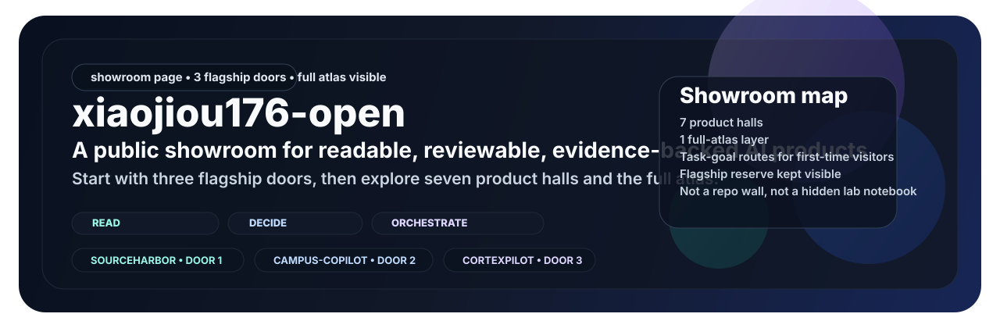

  

<h1 align="center">xiaojiou176-open</h1>

<strong>Open-source AI tools for browser workflows, source-grounded research, and practical operator software.</strong>

  
  
  
  

  <a href="https://github.com/xiaojiou176"><strong>Builder profile</strong></a> •
  <a href="#start-with-these-six"><strong>Start here</strong></a> •
  <a href="#full-repo-atlas"><strong>Full atlas</strong></a> •
  <a href="#design-principles"><strong>Design principles</strong></a>

This organization is the public showcase for software that should make sense from the outside. The goal is simple: when someone lands here, they should be able to tell what each repo helps a user do, where to start, and why the product is worth a closer look. It is a portfolio, not a dumping ground.

Built by [Terry Yu](https://github.com/xiaojiou176).

## What lives here

The repositories in this org are organized around five connected product lines:

<table>
  <tr>
    <td width="50%" valign="top">
      <strong>AI orchestration and control planes</strong> 
      Software for running work, supervising execution, and reviewing what happened after the run.  
      <strong>Representative repos:</strong> 
      <a href="https://github.com/xiaojiou176-open/CortexPilot-public">CortexPilot-public</a> 
      <a href="https://github.com/xiaojiou176-open/ui-automation-control-plane">ui-automation-control-plane</a>
    </td>
    <td width="50%" valign="top">
      <strong>Auditable browser workflows</strong> 
      Turning browser flows into repeatable proof instead of black-box automation.  
      <strong>Representative repos:</strong> 
      <a href="https://github.com/xiaojiou176-open/prooftrail">prooftrail</a> 
      <a href="https://github.com/xiaojiou176-open/ui-automation-control-plane">ui-automation-control-plane</a>
    </td>
  </tr>
  <tr>
    <td width="50%" valign="top">
      <strong>Research and knowledge systems</strong> 
      Tools for turning raw sources into reusable notes, searchable corpora, and inspectable outputs.  
      <strong>Representative repos:</strong> 
      <a href="https://github.com/xiaojiou176-open/sourceharbor">sourceharbor</a> 
      <a href="https://github.com/xiaojiou176-open/provenote">provenote</a> 
      <a href="https://github.com/xiaojiou176-open/docsiphon">docsiphon</a>
    </td>
    <td width="50%" valign="top">
      <strong>Product-facing AI tools</strong> 
      User-facing AI products that do a concrete job instead of stopping at a cool demo.  
      <strong>Representative repos:</strong> 
      <a href="https://github.com/xiaojiou176-open/openui-mcp-studio">openui-mcp-studio</a> 
      <a href="https://github.com/xiaojiou176-open/multi-ai-sidepanel">multi-ai-sidepanel</a> 
      <a href="https://github.com/xiaojiou176-open/campus-copilot">campus-copilot</a>
    </td>
  </tr>
  <tr>
    <td width="50%" valign="top">
      <strong>Local-first utilities and recovery tools</strong> 
      Useful software with visible recovery paths, practical ownership, and clear user outcomes.  
      <strong>Representative repos:</strong> 
      <a href="https://github.com/xiaojiou176-open/apple-notes-snapshot">apple-notes-snapshot</a> 
      <a href="https://github.com/xiaojiou176-open/apple-notes-forensics">apple-notes-forensics</a> 
      <a href="https://github.com/xiaojiou176-open/movi-organizer">movi-organizer</a> 
      <a href="https://github.com/xiaojiou176-open/dealwatch">dealwatch</a>
    </td>
    <td width="50%" valign="top">
      <strong>Public collaboration baseline</strong> 
      Public CI is hosted-first, sensitive lanes are explicitly gated, and operator state is visible instead of buried in personal infrastructure.  
      <strong>Why it matters:</strong> 
      This org is meant to feel like a curated public product line, not a hidden lab notebook.
    </td>
  </tr>
</table>

## Start with these six

If this is your first visit, these six repos are the fastest way to understand the shape of the portfolio:

<table>
  <tr>
    <td width="33%" valign="top">
      <strong><a href="https://github.com/xiaojiou176-open/CortexPilot-public">CortexPilot-public</a></strong> 
      Run governed AI tasks, inspect evidence bundles, and replay failures without guesswork.
    </td>
    <td width="33%" valign="top">
      <strong><a href="https://github.com/xiaojiou176-open/ui-automation-control-plane">ui-automation-control-plane</a></strong> 
      Run browser workflows, review proof, and decide whether a result is ready to ship.
    </td>
    <td width="33%" valign="top">
      <strong><a href="https://github.com/xiaojiou176-open/provenote">provenote</a></strong> 
      Import one source, search it, and export auditable markdown you can inspect later.
    </td>
  </tr>
  <tr>
    <td width="33%" valign="top">
      <strong><a href="https://github.com/xiaojiou176-open/prooftrail">prooftrail</a></strong> 
      Run one workflow, inspect one evidence bundle, and recover with facts instead of guesswork.
    </td>
    <td width="33%" valign="top">
      <strong><a href="https://github.com/xiaojiou176-open/sourceharbor">sourceharbor</a></strong> 
      Subscribe to source streams and turn them into digests, job traces, and searchable artifacts.
    </td>
    <td width="33%" valign="top">
      <strong><a href="https://github.com/xiaojiou176-open/openui-mcp-studio">openui-mcp-studio</a></strong> 
      Turn UI briefs into React and shadcn files you can preview and verify.
    </td>
  </tr>
</table>

## What to expect from repos here

Across this org, the public repos should make three things easy to find:

- the fastest honest first result
- the docs page that gets a new visitor moving
- the boundary between what is already public-proof and what still needs local setup or maintainer-only steps

## Full repo atlas

All **13 public repositories**, with no hiding:

### 1. AI orchestration and control planes

| Repo | What it does |
| --- | --- |
| [CortexPilot-public](https://github.com/xiaojiou176-open/CortexPilot-public) | Governed AI task orchestration with evidence, replay, and operator visibility |
| [ui-automation-control-plane](https://github.com/xiaojiou176-open/ui-automation-control-plane) | Browser automation control plane for repeatable proof and release-ready quality gates |

### 2. Auditable browser workflows

| Repo | What it does |
| --- | --- |
| [prooftrail](https://github.com/xiaojiou176-open/prooftrail) | Auditable browser automation for repeatable runs and recovery-ready workflows |
| [multi-ai-sidepanel](https://github.com/xiaojiou176-open/multi-ai-sidepanel) | Local-first browser extension for side-by-side AI comparison |
| [campus-copilot](https://github.com/xiaojiou176-open/campus-copilot) | Local-first academic organizer for Canvas, Gradescope, EdStem, and MyUW |

### 3. Research and knowledge systems

| Repo | What it does |
| --- | --- |
| [sourceharbor](https://github.com/xiaojiou176-open/sourceharbor) | Turn YouTube, Bilibili, and RSS into searchable digests and traceable knowledge flows |
| [provenote](https://github.com/xiaojiou176-open/provenote) | Source-grounded writing, searchable sources, auditable markdown, and traceable outputs |
| [docsiphon](https://github.com/xiaojiou176-open/docsiphon) | Convert docsites into AI-ready local corpora with preserved paths and audit artifacts |

### 4. Product-facing AI tools

| Repo | What it does |
| --- | --- |
| [openui-mcp-studio](https://github.com/xiaojiou176-open/openui-mcp-studio) | Generate, apply, and verify production-ready React and shadcn UI from natural-language briefs |
| [dealwatch](https://github.com/xiaojiou176-open/dealwatch) | Cross-store grocery price tracking with compare preview, watch tasks, effective price, and alert history |

### 5. Local-first utilities and recovery tools

| Repo | What it does |
| --- | --- |
| [apple-notes-snapshot](https://github.com/xiaojiou176-open/apple-notes-snapshot) | Local-first Apple Notes backup control room for macOS |
| [apple-notes-forensics](https://github.com/xiaojiou176-open/apple-notes-forensics) | Copy-first Apple Notes recovery toolkit with reviewable outputs |
| [movi-organizer](https://github.com/xiaojiou176-open/movi-organizer) | Local-first AI-assisted media organizer with manifest-driven workflows |

## Suggested paths

- **For orchestration:** start with [CortexPilot-public](https://github.com/xiaojiou176-open/CortexPilot-public)
- **For browser automation:** start with [ui-automation-control-plane](https://github.com/xiaojiou176-open/ui-automation-control-plane) and [prooftrail](https://github.com/xiaojiou176-open/prooftrail)
- **For research workflows:** start with [sourceharbor](https://github.com/xiaojiou176-open/sourceharbor), [provenote](https://github.com/xiaojiou176-open/provenote), and [docsiphon](https://github.com/xiaojiou176-open/docsiphon)
- **For AI product interfaces:** start with [openui-mcp-studio](https://github.com/xiaojiou176-open/openui-mcp-studio) and [multi-ai-sidepanel](https://github.com/xiaojiou176-open/multi-ai-sidepanel)
- **For local-first utilities:** start with [apple-notes-snapshot](https://github.com/xiaojiou176-open/apple-notes-snapshot), [apple-notes-forensics](https://github.com/xiaojiou176-open/apple-notes-forensics), and [movi-organizer](https://github.com/xiaojiou176-open/movi-organizer)

## Design principles

- Local-first when it improves trust, ownership, and recovery
- Evidence-first when systems make claims about what happened
- Operator-visible instead of demo-only
- Hosted-first public CI with explicit gates for sensitive lanes
- Real workflows over decorative prototypes

## Suggested tours

- **If you want the flagship systems first:** start with [CortexPilot-public](https://github.com/xiaojiou176-open/CortexPilot-public) and [ui-automation-control-plane](https://github.com/xiaojiou176-open/ui-automation-control-plane)
- **If you care about proof, repeatability, and browser evidence:** start with [prooftrail](https://github.com/xiaojiou176-open/prooftrail)
- **If you care about source-grounded research:** start with [sourceharbor](https://github.com/xiaojiou176-open/sourceharbor), [provenote](https://github.com/xiaojiou176-open/provenote), and [docsiphon](https://github.com/xiaojiou176-open/docsiphon)
- **If you want product-facing AI UX:** start with [openui-mcp-studio](https://github.com/xiaojiou176-open/openui-mcp-studio), [multi-ai-sidepanel](https://github.com/xiaojiou176-open/multi-ai-sidepanel), and [campus-copilot](https://github.com/xiaojiou176-open/campus-copilot)
- **If you want local-first recovery and utility tools:** start with [apple-notes-snapshot](https://github.com/xiaojiou176-open/apple-notes-snapshot), [apple-notes-forensics](https://github.com/xiaojiou176-open/apple-notes-forensics), [movi-organizer](https://github.com/xiaojiou176-open/movi-organizer), and [dealwatch](https://github.com/xiaojiou176-open/dealwatch)
