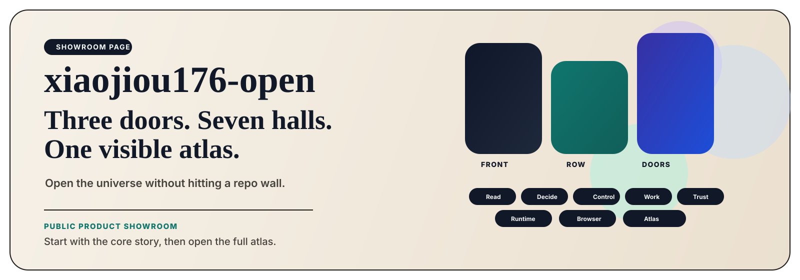

  

<h1 align="center">xiaojiou176-open</h1>

<strong>A public showroom for readable, reviewable, evidence-backed AI products.</strong> Start with three flagship doors, then explore seven product halls and the full atlas.

  <a href="https://github.com/xiaojiou176"><strong>Builder profile</strong></a> •
  <a href="#2--start-with-the-three-flagship-doors"><strong>Start with the front row</strong></a> •
  <a href="#3--choose-a-route-by-goal"><strong>Choose a route</strong></a> •
  <a href="#4--walk-the-seven-product-halls"><strong>The seven halls</strong></a>

> **Why this page exists**  
> This showroom is here to stop first-time visitors from hitting a repo wall. Start with the three flagship doors, then walk the product halls by goal.

| **3 flagship doors** | **7 product halls** | **Task-led routes** | **Full atlas visible** |
| --- | --- | --- | --- |
| the core story first | the system after the hook | navigate by problem, not title | the universe stays visible |

## 1. ✨ Why This Showroom Matters

1. **It gives you the story before the repo wall.**  
   You should be able to understand what this builder is making before you are asked to parse a grid of repositories.

2. **It separates the universe from the individual products.**  
   The page first shows the three strongest doors into the portfolio, then explains the halls behind them, then lets you walk the full atlas.

3. **It lets you navigate by goal instead of guessing from names.**  
   If you care about reading products, decision workspaces, runtime foundations, or browser-native product lines, you should know exactly where to start.

## 2. 🚪 Start With the Three Flagship Doors

These are parallel doors into the portfolio. They keep the canonical order, but they are meant to be entered side by side, not read like a prize ranking.

<table>
  <tr>
    <td width="33%" valign="top">
      <strong><a href="https://github.com/xiaojiou176-open/sourceharbor">SourceHarbor</a></strong> 
      <strong>Read</strong>  
      <strong>The need</strong> 
      People can subscribe to more and more sources, but still never end up with something truly readable.  
      <strong>The breakout</strong> 
      A reader-first product that turns raw source streams into traceable reading outputs worth keeping.  
      <strong>Why start here</strong> 
      This is the clearest doorway into Terry's "read the world" thesis.
    </td>
    <td width="33%" valign="top">
      <strong><a href="https://github.com/xiaojiou176-open/campus-copilot">campus-copilot</a></strong> 
      <strong>Decide</strong>  
      <strong>The need</strong> 
      In real academic systems, information is scattered across high-constraint surfaces, and a user still has to guess the next move.  
      <strong>The breakout</strong> 
      A local-first decision workspace that helps users choose well without pretending the system can safely do more than it should.  
      <strong>Why start here</strong> 
      This is the fastest proof that the universe can enter real, sensitive domains without bluffing the boundary.
    </td>
    <td width="33%" valign="top">
      <strong><a href="https://github.com/xiaojiou176-open/CortexPilot-public">CortexPilot-public</a></strong> 
      <strong>Orchestrate</strong>  
      <strong>The need</strong> 
      Workflows often run without trust, because request, execution, proof, and replay are split apart.  
      <strong>The breakout</strong> 
      A governed control plane that keeps execution, proof, and replay in one system instead of scattering them across tools.  
      <strong>Why start here</strong> 
      This is the clearest proof that the portfolio is building operator-grade systems, not just surfaces.
    </td>
  </tr>
</table>

## 3. 🧭 Choose a Route by Goal

1. **Understand how Terry turns messy inputs into readable products.**  
   Start with [SourceHarbor](https://github.com/xiaojiou176-open/sourceharbor), then go deeper through the reading hall.

2. **See real-world decision systems with clear boundaries.**  
   Start with [campus-copilot](https://github.com/xiaojiou176-open/campus-copilot), then explore the decision hall.

3. **Inspect operator workflows and governed execution.**  
   Start with [CortexPilot-public](https://github.com/xiaojiou176-open/CortexPilot-public), then continue into control and workflow systems.

4. **Explore runtime, proof, and system foundations.**  
   Jump to [Switchyard](https://github.com/xiaojiou176-open/Switchyard), [prooftrail](https://github.com/xiaojiou176-open/prooftrail), and [ui-automation-control-plane](https://github.com/xiaojiou176-open/ui-automation-control-plane).

5. **Browse browser-native product lines.**  
   Open [Shopflow](https://github.com/xiaojiou176-open/shopflow-suite) once you want to see the consumer-facing side of the universe.

## 4. 🏛️ Walk the Seven Product Halls

### 1. Reading and Knowledge Products
_Internal canon: Reader And Knowledge Rewriting_

When the problem is **“I have too much source material and not enough clarity,”** start here.

- [SourceHarbor](https://github.com/xiaojiou176-open/sourceharbor) — reader-first, no-loss reading products built from raw source streams.
- [docsiphon](https://github.com/xiaojiou176-open/docsiphon) — docsites turned into local, rerunnable, AI-ready corpora.

### 2. Real-World Decision Workspaces
_Internal canon: Academic Decision Workspace_

When the problem is **“I know where the information is, but I still do not know what to do next,”** start here.

- [campus-copilot](https://github.com/xiaojiou176-open/campus-copilot) — a local-first academic decision workspace with explicit boundaries.
- [dealwatch](https://github.com/xiaojiou176-open/dealwatch) — compare-first buying decisions across messy storefront surfaces.

### 3. Control and Workflow Systems
_Internal canon: Decision And Control Towers_

When the problem is **“the workflow can run, but it still cannot be trusted,”** start here.

- [CortexPilot-public](https://github.com/xiaojiou176-open/CortexPilot-public) — the governed control plane for requests, execution, proof, and replay.

### 4. AI Workbenches
_Internal canon: Agent Workbenches_

When the problem is **“AI chat is not enough; I need a structured workspace,”** start here.

- [multi-ai-sidepanel](https://github.com/xiaojiou176-open/multi-ai-sidepanel) — one prompt, many models, one browser workspace.
- [provenote](https://github.com/xiaojiou176-open/provenote) — long context compressed into reviewable research outcomes.
- [openui-mcp-studio](https://github.com/xiaojiou176-open/openui-mcp-studio) — UI delivery from brief to production-ready workspace change.
- [agent-exporter](https://github.com/xiaojiou176-open/agent-exporter) — transcript export turned into archive, evidence, and governance workbench.

### 5. Local Trust Labs
_Internal canon: Local Artifact Labs_

When the problem is **“this action is risky, and I need review, rollback, or recovery before I trust it,”** start here.

- [apple-notes-snapshot](https://github.com/xiaojiou176-open/apple-notes-snapshot) — visible health checks and structured exports for Apple Notes backup.
- [apple-notes-forensics](https://github.com/xiaojiou176-open/apple-notes-forensics) — copy-first, reviewable recovery tooling for Apple Notes.
- [movi-organizer](https://github.com/xiaojiou176-open/movi-organizer) — review-first file organization with deterministic apply and rollback.

### 6. Runtime and Proof Foundations
_Internal canon: Runtime And Evidence Substrate_

When the problem is **“the product looks good, but what system makes it trustworthy underneath?”** start here.

- [Switchyard](https://github.com/xiaojiou176-open/Switchyard) — the shared runtime kernel for provider access and reusable AI foundations.
- [prooftrail](https://github.com/xiaojiou176-open/prooftrail) — evidence-first browser automation substrate with recovery and repair built in.
- [ui-automation-control-plane](https://github.com/xiaojiou176-open/ui-automation-control-plane) — an AI-native WebUI stress lab for proof, review, and workflow experimentation.

### 7. Browser Product Families
_Internal canon: Browser Commerce Family_

When the question is **“can all this system depth become something a normal user can actually feel?”** start here.

- [Shopflow](https://github.com/xiaojiou176-open/shopflow-suite) — the browser-native shopping product family spanning storefront workflows.

### 8. Full Atlas
_Internal canon: Full Atlas Layer_

This is not a separate product family. It is the promise that the whole universe stays visible instead of collapsing into a three-repo highlight reel.

## 5. ⭐ Flagship Reserve

These are the highest-weight supporting doors around the front row.

- [docsiphon](https://github.com/xiaojiou176-open/docsiphon) — the fastest extra doorway if you want CLI/corpus engineering.
- [Shopflow](https://github.com/xiaojiou176-open/shopflow-suite) — the clearest proof of a consumer-facing browser product family.
- [Switchyard](https://github.com/xiaojiou176-open/Switchyard) — the runtime/access foundation under the visible products.
- [agent-exporter](https://github.com/xiaojiou176-open/agent-exporter) — the clearest governance and archive-discipline workbench in the universe.

## 6. 🔍 Why This Is Not a Repo Wall

- **Because the front row is an entry, not the whole story.**
- **Because the seven halls explain what kinds of product problems this universe attacks.**
- **Because the full atlas stays visible instead of hiding the deeper system layers.**
- **Because the page is organized around visitor goals, not around random repository names.**
