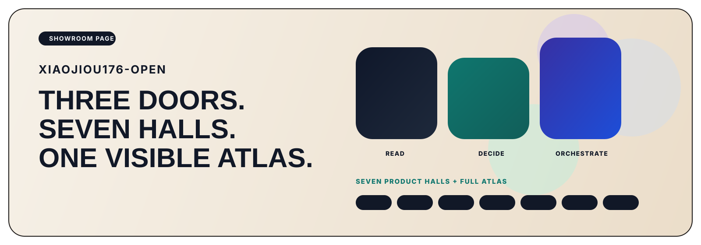

  

<h1 align="center">xiaojiou176-open</h1>

<strong>A public showroom for readable, reviewable, evidence-backed AI products.</strong> Start with three flagship doors, then explore seven product halls and the full atlas.

  <a href="https://github.com/xiaojiou176"><strong>Builder profile</strong></a> •
  <a href="#1--pick-a-door"><strong>Pick a door</strong></a> •
  <a href="#2--choose-by-the-job-you-care-about"><strong>Choose by job</strong></a> •
  <a href="#3--walk-the-seven-halls"><strong>Walk the halls</strong></a>

> This page is a map, not a repo wall.  
> Take one door. If it clicks, the rest of the atlas will make sense.  
> Built in public out of **Seattle, WA (PT)**.

| **3 flagship doors** | **7 product halls** | **Task-led routes** | **Full atlas visible** |
| --- | --- | --- | --- |
| the core story first | the deeper system after the hook | navigate by problem, not by title | the universe stays visible |

## 1. 🚪 Pick a Door

These are the three fastest entrances into the portfolio. They keep the canonical order, but they are not a prize ranking.

### SourceHarbor
**If the hard part is turning raw inputs into something readable, start here.**  
Ingest raw source streams. Merge them. Ship reading-grade outputs a human would actually keep.

### campus-copilot
**If the hard part is choosing under real constraints, start here.**  
This is where the portfolio routes scattered academic surfaces into one decision workspace without pretending the boundary does not exist.

### CortexPilot-public
**If the hard part is making execution trustworthy, start here.**  
Record the request. Run the workflow. Keep proof next to the run. Replay failures when the system breaks.

## 2. 🧭 Choose by the Job You Care About

1. **I need better reading outputs, not more feeds.**  
   Start with [SourceHarbor](https://github.com/xiaojiou176-open/sourceharbor), then move into the reading hall.

2. **I need help choosing under pressure, constraints, or messy interfaces.**  
   Start with [campus-copilot](https://github.com/xiaojiou176-open/campus-copilot), then continue into the decision hall.

3. **I need workflows that can be inspected instead of trusted on faith.**  
   Start with [CortexPilot-public](https://github.com/xiaojiou176-open/CortexPilot-public), then continue into control and proof foundations.

4. **I care about runtime, access, proof, and recovery.**  
   Jump to [Switchyard](https://github.com/xiaojiou176-open/Switchyard), [prooftrail](https://github.com/xiaojiou176-open/prooftrail), and [ui-automation-control-plane](https://github.com/xiaojiou176-open/ui-automation-control-plane).

5. **I want the browser-native, user-facing side first.**  
   Open [Shopflow](https://github.com/xiaojiou176-open/shopflow-suite) once you want to see the consumer-facing branch of the portfolio.

## 3. 🏛️ Walk the Seven Halls

### 1. Reading and Knowledge Products
This hall exists for one kind of pain: **too much source material, not enough clarity**.

- [SourceHarbor](https://github.com/xiaojiou176-open/sourceharbor) — reader-first, no-loss reading products built from raw source streams.
- [docsiphon](https://github.com/xiaojiou176-open/docsiphon) — docsites turned into local, rerunnable, AI-ready corpora.

### 2. Real-World Decision Workspaces
This hall is not about “show me more data.” It is about **helping someone choose the next move without crossing the line**.

- [campus-copilot](https://github.com/xiaojiou176-open/campus-copilot) — a local-first academic decision workspace with explicit boundaries.
- [dealwatch](https://github.com/xiaojiou176-open/dealwatch) — compare-first buying decisions across messy storefront surfaces.

### 3. Control and Workflow Systems
This is the hall for cases where **a workflow can run, but nobody should trust it yet**.

- [CortexPilot-public](https://github.com/xiaojiou176-open/CortexPilot-public) — the governed control plane for requests, execution, proof, and replay.

### 4. AI Workbenches
Come here when **a chat box is not enough and the work needs a real workspace**.

- [multi-ai-sidepanel](https://github.com/xiaojiou176-open/multi-ai-sidepanel) — one prompt, many models, one browser workspace.
- [provenote](https://github.com/xiaojiou176-open/provenote) — long context compressed into reviewable research outcomes.
- [openui-mcp-studio](https://github.com/xiaojiou176-open/openui-mcp-studio) — UI delivery from brief to production-ready workspace change.
- [agent-exporter](https://github.com/xiaojiou176-open/agent-exporter) — transcript export turned into archive, evidence, and governance workbench.

### 5. Local Trust Labs
This hall exists for the moment when **the action is risky and rollback matters more than speed**.

- [apple-notes-snapshot](https://github.com/xiaojiou176-open/apple-notes-snapshot) — visible health checks and structured exports for Apple Notes backup.
- [apple-notes-forensics](https://github.com/xiaojiou176-open/apple-notes-forensics) — copy-first, reviewable recovery tooling for Apple Notes.
- [movi-organizer](https://github.com/xiaojiou176-open/movi-organizer) — review-first file organization with deterministic apply and rollback.

### 6. Runtime and Proof Foundations
This is where you go if the question is: **what makes the rest of the system trustworthy underneath?**

- [Switchyard](https://github.com/xiaojiou176-open/Switchyard) — the shared runtime kernel for provider access and reusable AI foundations.
- [prooftrail](https://github.com/xiaojiou176-open/prooftrail) — evidence-first browser automation substrate with recovery and repair built in.
- [ui-automation-control-plane](https://github.com/xiaojiou176-open/ui-automation-control-plane) — an AI-native WebUI stress lab for proof, review, and workflow experimentation.

### 7. Browser Product Families
This hall answers a very practical question: **can all this system depth turn into something a normal user can actually feel?**

- [Shopflow](https://github.com/xiaojiou176-open/shopflow-suite) — the browser-native shopping product family spanning storefront workflows.

### 8. Full Atlas
The atlas stays visible on purpose.  
If the deeper layers disappear, the front row turns into marketing. This org only makes sense if the whole system remains legible.

## 4. ⭐ Flagship Reserve

If you want the strongest supporting doors around the front row, open these next:

- [docsiphon](https://github.com/xiaojiou176-open/docsiphon) — the fastest extra doorway if you want CLI/corpus engineering.
- [Shopflow](https://github.com/xiaojiou176-open/shopflow-suite) — the clearest proof of a consumer-facing browser product family.
- [Switchyard](https://github.com/xiaojiou176-open/Switchyard) — the runtime/access foundation under the visible products.
- [agent-exporter](https://github.com/xiaojiou176-open/agent-exporter) — the clearest archive and governance workbench in the system.

## 5. 🔍 How to Read This Page

- **Use the front row if you want the shortest path in.**
- **Use the halls if you want the system grouped by the job it solves.**
- **Use the atlas if you want the deeper layers to stay visible instead of hiding behind three highlight repos.**
